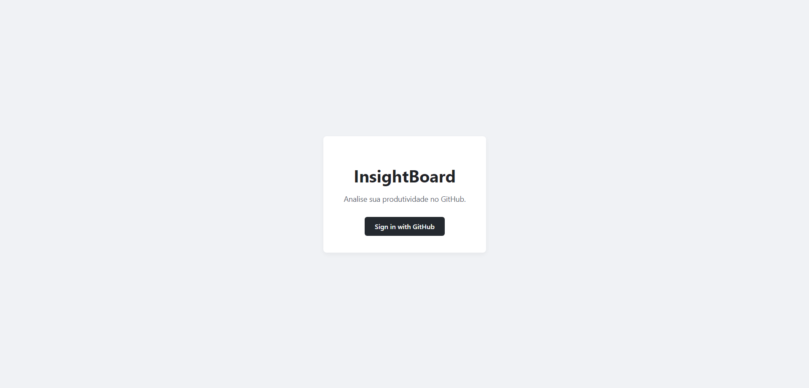
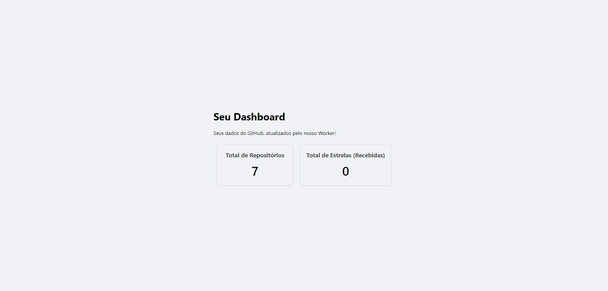

# InsightBoard: Personal Developer Metrics Dashboard

A full-stack, containerized application that connects to your GitHub account (via OAuth2) to aggregate, analyze, and display your personal development metrics. Data is collected via a background worker, cached in a MySQL database, and served to a React dashboard via a secure, session-based Node.js API.

## Key Features & Visuals

This project demonstrates a complete, end-to-end, resilient software architecture. The data is collected by an asynchronous background worker, cached, and displayed instantly upon user login.

| Login Page | Secure Dashboard |
| :---: | :---: |
|  |  |
| A clean React SPA landing page that initiates the GitHub OAuth2 flow. | An authenticated dashboard that fetches and renders data from the API's cache (populated by the worker). |

**Features Include:**
* **Secure GitHub OAuth2 Flow:** Full authentication cycle using JWTs stored in secure, httpOnly cookies.
* **Asynchronous Data Worker:** A separate container service (`worker`) runs on a schedule to fetch data from the GitHub API (using the user's encrypted token) without blocking the UI.
* **Resilient Architecture:** API and Worker services feature a built-in connection retry logic to handle database boot order during startup (solving race conditions).
* **Metrics Caching:** GitHub data is processed and stored in a MySQL cache table, ensuring the dashboard loads instantly.
* **Full Containerization:** The entire 4-service stack (Web, API, Worker, DB) is fully orchestrated with Docker Compose.
* **Production-Ready Frontend:** The React app is served via Nginx with a reverse proxy configured to route `/api` requests to the backend API container.

---

## Architectural Diagram

This system is comprised of four distinct containerized services within a single Docker network, demonstrating a clean separation of concerns (SoC). The API is responsible for fast user interactions (auth, reads), while a separate Worker service handles slow/asynchronous data ingestion.

graph TD
    subgraph "Atores Externos"
        direction LR
        U(User Browser)
        GH([GitHub API Externa])
    end

    subgraph "InsightBoard (Docker Network)"
        direction LR
        
        subgraph "Serviço Frontend (Nginx Container)"
            FE[Frontend (React + Nginx)]
        end

        subgraph "Serviço API (Node Container)"
            API[API (Express + JWT/Cookies)]
        end
        
        subgraph "Serviço Worker (Node Container)"
            WKR[Worker (Node-Scheduler)]
        end

        subgraph "Serviço Database"
            DB[(MySQL Database)]
        end
    end

    %% Fluxo de Autenticação e Dados do Usuário
    U -- 1. Carrega Página (Porta 3000) --> FE
    FE -- 2. GET /api/metrics (com Cookie JWT) (Proxy Reverso Nginx) --> API
    API -- 3. Lê Cache de Métricas --> DB
    API -- 4. Retorna JSON para UI --> FE
    FE -- 5. Exibe Dados no Dashboard --> U
    
    %% Fluxo de Auth (Apenas 1x)
    FE -- Redireciona para Login --> GH
    GH -- OAuth Callback --> API
    API -- Salva User/Token Criptografado --> DB

    %% Fluxo do Worker (Background Loop)
    WKR -- A. Lê Usuários/Tokens do DB --> DB
    WKR -- B. Busca Dados (Repos/Stats) --> GH
    WKR -- C. Processa e Escreve Métricas --> DB(metrics_cache)